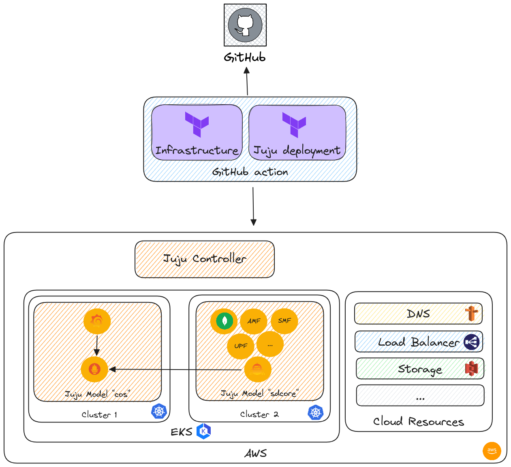

# Juju GitOps

A GitOps driven approach to drive the lifecycle management of infrastructure and applications
using Terraform and Juju.

## Content

This project maintains a Mattermost deployment running on AWS.

## TODO

1. Add cross model relationship between COS and Mattermost. Right now the released version of postgresql-k8s does not support the metrics integration.
2. Add ingress relation between Mattermost and Traefik. Right now Mattermost does not support this relation.
